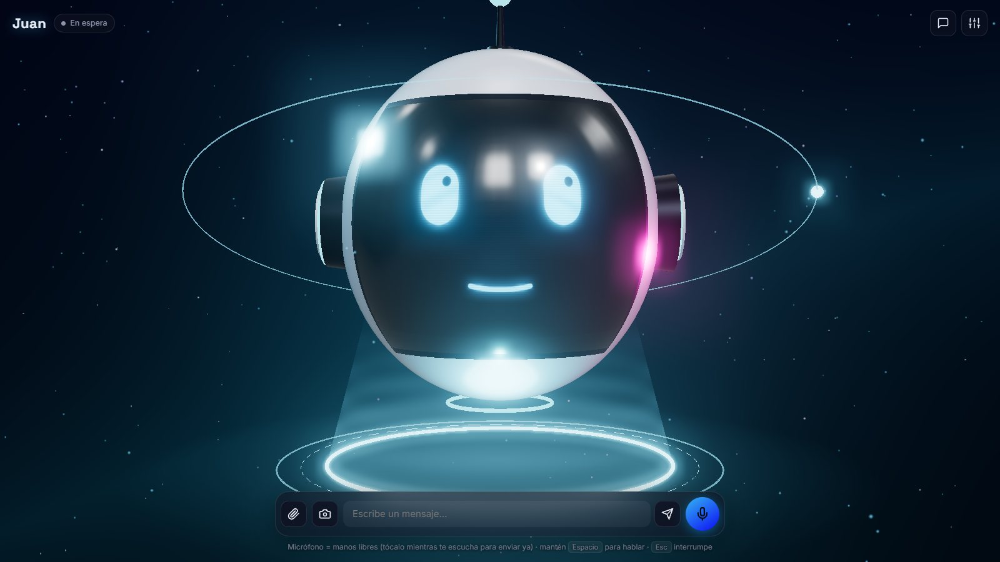

# Avatar 3D con Groq

Una cabeza robot en 3D, flotando en el espacio, con la que hablas por voz. Puede ver por tu cámara, mirar las imágenes que le pases y mueve los labios al hablar. Puedes cambiarle la personalidad desde la interfaz.

**[Ver la página del proyecto, con el avatar en vivo →](https://yeffrimic.github.io/avataresrobots/)**



## Índice

- [Requisitos](#requisitos)
- [Arranque](#arranque)
- [Uso](#uso)
- [Personalidad](#personalidad)
- [Cómo funciona](#cómo-funciona)
  - [Sincronización labial](#sincronización-labial)
  - [Modelos](#modelos)
- [Usar tu propia cabeza 3D](#usar-tu-propia-cabeza-3d)
- [Plataformas](#plataformas)
  - [Desde el móvil](#desde-el-móvil)
- [Solución de problemas](#solución-de-problemas)

## Requisitos

- **Node.js 22 o superior** en el equipo que hace de servidor. No hay dependencias que instalar.
- **Una clave de Groq**, gratis en https://console.groq.com/keys. No viene incluida: cada quien usa la suya.
- **Un navegador:** Firefox 112+, Chrome o Edge 99+, o Safari 16.4+ (iPhone con iOS 16.4+). Necesita WebGL 2.
- **Un PC modesto:** 2 núcleos, 4 GB de RAM y gráfica integrada tipo Intel HD 620 o AMD Vega 8. Lo recomendado son 8 GB.
- **Micrófono**, y webcam si quieres que vea.
- **Conexión a internet:** Groq, la voz de Microsoft y Three.js funcionan por internet. Basta con 1 Mbps estable.

## Arranque

1. Necesitas **Node.js 22 o superior**. No hay que instalar dependencias. En Pop!_OS o Ubuntu, el Node de `apt` suele ser antiguo; instálalo así:
   ```
   curl -fsSL https://deb.nodesource.com/setup_22.x | sudo -E bash -
   sudo apt install -y nodejs
   ```
2. Copia `.env.example` a `.env` y pon tu clave de https://console.groq.com/keys. También puedes pegarla luego en **Ajustes → Groq**.
3. Ejecuta:
   ```
   npm start
   ```
4. Abre http://localhost:3000 en Firefox, Chrome, Edge o Safari.

## Uso

| Acción | Cómo |
|---|---|
| Conversar con las manos libres | Botón del micrófono: te escucha, detecta cuándo terminas de hablar y responde |
| Pulsar para hablar | Mantén pulsada la tecla **Espacio** |
| Interrumpir | **Esc** o el botón ■ |
| Que vea lo que ves | Botón de la cámara. Con el botón ↻ cambias entre la cámara frontal y la trasera |
| Mostrarle imágenes | 📎, arrastrar y soltar, o pegar con Ctrl+V |
| Escribir | La caja de texto |
| Mover la vista | Arrastra con el ratón y usa la rueda para acercar o alejar |

Mientras el avatar habla, el micrófono se silencia para que no se escuche a sí mismo. Si usas auriculares, activa **«Poder interrumpirle hablando»**.

## Personalidad

- **Desde la interfaz:** abre Ajustes → Personalidad. Ahí cambias el nombre, la descripción y el color, y puedes guardar la personalidad como nueva. Todo se guarda en el navegador.
- **Desde el código:** edita `public/js/personalities.js`. Cada personalidad es un bloque de texto y puede tener su propia voz (`msVoice`).

Vienen incluidas: **Juan** (co-presentador guatemalteco para charlas con niños y jóvenes, con voz de Guatemala), Nova, Profe Chispa, Capitán Sarcasmo, Zen y Ojo de Halcón.

El avatar puede mostrar emociones (feliz, triste, sorprendido, pensativo, enojado). El modelo las marca con etiquetas como `[feliz]`, que no se leen en voz alta.

## Cómo funciona

```
voz ─► VAD (mic.js) ─► Whisper (Groq) ─► texto
                                         │  + foto de la cámara / imágenes
                                         ▼
                         Qwen con visión (Groq, en streaming)
                                         │  frase a frase
                                         ▼
   voz neuronal de Microsoft (servidor) ─► lip-sync (lipsync.js) ─► rostro 3D (avatar.js)
```

| Archivo | Qué hace |
|---|---|
| `server.js` | Sirve la app (HTTP o HTTPS) y hace de proxy a Groq, para que la clave no llegue al navegador |
| `mstts.js` | Genera la voz en español con las voces neuronales de Microsoft |
| `gen-cert.js` | Crea el certificado HTTPS para usarlo desde el móvil |
| `public/js/main.js` | Orquesta la conversación, la interfaz, la cámara y las imágenes |
| `public/js/avatar.js` | Escena Three.js: la cabeza, el rostro dibujado en tiempo real, las emociones y la carga de modelos .glb |
| `public/js/lipsync.js` | Convierte el texto en visemas pensados para el español y los sincroniza con el audio |
| `public/js/speech.js` | Cola de voz: Microsoft, navegador o Groq TTS |
| `public/js/mic.js` | Detecta cuándo hablas, graba en WAV a 16 kHz y gestiona pulsar para hablar |
| `public/js/groq.js` | Llamadas a la API |

### Sincronización labial

- **Microsoft Neural** (predeterminada): 45 voces nativas en español de 22 países (México, España, Argentina, Colombia…), gratis y sin clave. El servidor genera el audio, así que suena igual en cualquier sistema y navegador. La secuencia de formas de boca se ajusta a la duración real del audio, y la apertura sigue el volumen. Usa el servicio de «Leer en voz alta» de Edge, que es **no oficial**: si algún día deja de funcionar, la app pasa sola a la voz del navegador.
- **Voz del navegador** (depende del equipo; en Linux suele sonar robótica): el texto se convierte en una secuencia de formas de boca (A, E, I, O, U, M/B/P, F…). Esa secuencia se vuelve a sincronizar con cada palabra que el sintetizador anuncia.
- **Groq Orpheus** (voz más natural, **solo en inglés**): la secuencia se ajusta a la duración real del audio y la apertura de la boca sigue el volumen. La primera vez tendrás que aceptar los términos del modelo en la consola de Groq.

### Modelos

Se cambian en Ajustes → Groq. La lista de sugerencias se carga desde tu cuenta de Groq.

- Chat con visión: `qwen/qwen3.8-27b`. Si el modelo guardado desaparece de Groq, la app elige otro disponible y te avisa.
- Voz a texto: `whisper-large-v3-turbo`
- Texto a voz: `canopylabs/orpheus-v1-english`

## Usar tu propia cabeza 3D

En Ajustes → Avatar 3D puedes cargar un `.glb` con blendshapes **ARKit** (`jawOpen`, `mouthFunnel`, `eyeBlinkLeft`…) u **Oculus visemes** (`viseme_aa`, `viseme_O`…). Si el modelo es un cuerpo humanoide, la cámara encuadra el hueso `Head` y recorta el resto del cuerpo. Para que se cargue siempre, guarda el archivo en `public/models/` y escribe la ruta (por ejemplo `/models/cabeza.glb`).

## Plataformas

Funciona en Linux, Windows y macOS, con Firefox, Chrome, Edge o Safari, y también en Android y iPhone. La voz se genera en el servidor, así que no depende de las voces que tenga instalado cada equipo.

### Desde el móvil

Los navegadores solo dejan usar la cámara y el micrófono en `localhost` o con HTTPS. Hay dos opciones:

**A. En la misma red wifi (sin internet extra):**
```
npm run cert     # una sola vez, crea un certificado propio
npm start        # muestra la dirección para el móvil, p. ej. https://192.168.1.5:3000
```
Abre esa dirección en el móvil. Saldrá un aviso de seguridad porque el certificado es propio: toca **Avanzado → Continuar**. Si cambia la IP del equipo, vuelve a ejecutar `npm run cert`.

**B. Con un túnel** (enlace HTTPS válido, también sirve fuera de tu red): `cloudflared tunnel --url http://localhost:3000`. Cualquiera que tenga el enlace podrá usar tu avatar y tu clave de Groq, así que ciérralo al terminar.

En el móvil no hay tecla Espacio: usa el botón del micrófono para hablar con las manos libres.

## Solución de problemas

| Síntoma | Qué hacer |
|---|---|
| Se queda en «Te escucho…» | Toca el micrófono o pulsa Espacio para enviar lo grabado. Para ver qué capta el micrófono, abre `http://localhost:3000/?debug` o mira el medidor en Ajustes → Escucha y visión. |
| Nunca pasa a «Te escucho…» | Sube la sensibilidad en Ajustes. Revisa en el candado de la barra de direcciones que el navegador use el micrófono correcto. |
| «Voz Microsoft 405» | El servidor que está corriendo es una versión vieja. Reinícialo (Ctrl+C y `npm start`). |
| «Groq 429» o «límite por minuto» | El plan gratuito de Groq limita los tokens por minuto, y cada imagen gasta bastante. Espera unos segundos. |
| «El modelo … no existe» | Groq retira modelos de vez en cuando. La app elige otro sola; también puedes cambiarlo en Ajustes → Groq. |
